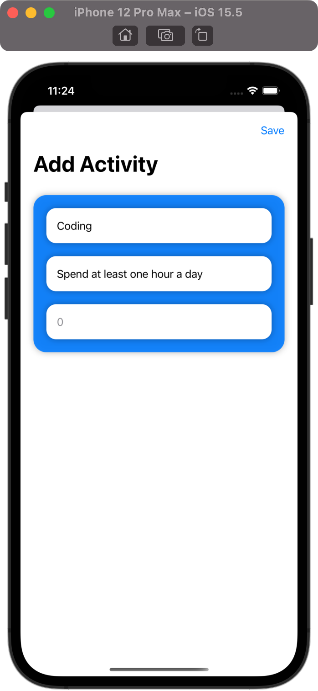

# HabitTracker

## Project Description

The challenge is a part of 100 Days of SwiftUI curriculum by Paul Hudson [Hacking with swift](https://www.hackingwithswift.com/100/swiftui)

This time your goal is to build a habit-tracking app, for folks who want to keep track of how much they do certain things. That might be learning a language, practicing an instrument, exercising, or whatever – they get to decide which activities they add, and track it however they want.

At the very least, this means there should be a list of all activities they want to track, plus a form to add new activities – a title and description should be enough.

Tapping one of the activities should show a detail screen with the description. Detail screen contains how many times they have completed it, plus a button incrementing their completion count.

## Project Screen

  
 

